# Symflow Issue Tracker

A runnable showcase for [`vandetho/symflow-laravel`](https://github.com/vandetho/symflow-laravel). A mini Jira-style tracker where every issue must clear **parallel code-review and QA review** before it can merge — implemented with Symfony-style Petri net semantics, role-based guards, transition middleware, and live Mermaid diagrams.

## What it demonstrates

| Engine feature | Where you see it |
|---|---|
| Petri-net AND-split | `submit_for_review` fans `in_progress` → `code_review` + `qa_review` |
| Petri-net AND-join | `merge` consumes `code_approved` AND `qa_approved` → `merged` |
| Guards | `approve_code` / `reject_code` need `role:reviewer`; `approve_qa` / `reject_qa` need `role:qa`; `merge` needs reviewer |
| `GuardResult` codes | The UI surfaces the exact reason ("Requires the qa role.") under disabled buttons |
| Middleware | `AuditLogMiddleware` writes `(actor, transition, before, after, reason)` for every fired transition |
| Workflow event listeners | `WorkflowEventType::Entered` listener logs each hop in `WorkflowServiceProvider::boot` |
| Live diagram | `MermaidExporter` output gets `classDef` highlighting injected per active place |

## The flow

```mermaid
flowchart LR
    open([open]) -->|start_work| in_progress[in_progress]
    open -->|close| closed([closed])

    in_progress -->|submit_for_review| code_review[code_review]
    in_progress -->|submit_for_review| qa_review[qa_review]

    code_review -->|"approve_code&nbsp;&#40;role:reviewer&#41;"| code_approved[code_approved]
    qa_review -->|"approve_qa&nbsp;&#40;role:qa&#41;"| qa_approved[qa_approved]

    code_review -->|"reject_code&nbsp;&#40;role:reviewer&#41;"| closed
    qa_review -->|"reject_qa&nbsp;&#40;role:qa&#41;"| closed

    code_approved -->|"merge&nbsp;&#40;role:reviewer&#41;"| merged([merged])
    qa_approved -->|merge| merged

    classDef good fill:#bbf7d0,stroke:#16a34a,color:#14532d;
    classDef bad fill:#fecdd3,stroke:#e11d48,color:#9f1239;
    class merged good;
    class closed bad;
```



A `workflow` (Petri net) — `submit_for_review` and `merge` operate on multiple tokens simultaneously.

## Run it locally

Requires **PHP 8.2+**, **Composer**, **Node 20+**, and a clone of [`symflow-laravel`](https://github.com/vandetho/symflow-laravel) sitting at `../symflow-laravel` (the package is consumed via a Composer **path repository**).

```bash
# 1. Clone both repos as siblings
git clone https://github.com/vandetho/symflow-laravel.git
git clone https://github.com/vandetho/symflow-laravel-issue-tracker.git

# 2. Install
cd symflow-laravel-issue-tracker
composer install
npm install

# 3. Configure
cp .env.example .env
php artisan key:generate
touch database/database.sqlite

# 4. Build database + frontend
php artisan migrate:fresh --seed
npm run build

# 5. Serve
php artisan serve
```

Open <http://localhost:8000> and use the **role switcher** in the top-right to sign in as a demo user.

> **Tip — live frontend reload:** in a second terminal run `npm run dev` instead of `npm run build` and Vite hot-reloads CSS/JS changes.

### Seeded users

| Role | Name | Email | Password |
|---|---|---|---|
| Developer | Ada Lovelace | `ada@symflow.test` | `password` |
| Developer | Grace Hopper | `grace@symflow.test` | `password` |
| Reviewer | Linus Torvalds | `linus@symflow.test` | `password` |
| QA | Margaret Hamilton | `margaret@symflow.test` | `password` |

## The workflow definition

Lives in [`config/laraflow.php`](config/laraflow.php) — same Symfony `framework.workflows` shape symflowbuilder.com exports.

## Architecture

```
app/
├── Enums/
│   ├── Role.php                          # developer | reviewer | qa
│   └── Priority.php                      # low | medium | high | critical
├── Models/Issue.php                      # uses HasWorkflowTrait
├── Workflow/
│   ├── RoleGuardEvaluator.php            # parses "role:X" against the authed user
│   ├── AuditLogMiddleware.php            # before/after marking on every transition
│   └── WorkflowReasonContext.php         # request-scoped store for transition reasons
├── Providers/WorkflowServiceProvider.php # rebinds the registry with our guard + middleware
└── Livewire/
    ├── Components/
    │   ├── RoleSwitcher.php              # demo "sign in as" dropdown
    │   └── WorkflowDiagram.php           # Mermaid + classDef per active place
    └── Pages/
        ├── Dashboard.php                 # kanban / table
        ├── IssueCreate.php
        └── IssueShow.php                 # action panel + activity timeline
```

### How the registry is wired

The package's `LaraflowServiceProvider` registers a default `WorkflowRegistryInterface` singleton that constructs `Workflow` objects without a guard evaluator. We override it in [`app/Providers/WorkflowServiceProvider.php`](app/Providers/WorkflowServiceProvider.php) so each workflow is built with our `RoleGuardEvaluator`, then attach `AuditLogMiddleware` and a logging listener in `boot()`.

### How a transition fires

1. Livewire button → `IssueShow::fire('approve_code')`
2. `Workflow::can()` runs the guard. With wrong role, the UI shows "Requires the reviewer role."
3. `WorkflowReasonContext::set($reason)` stashes the optional comment
4. `Workflow::apply()` walks the engine: guard → leave → transition → enter → entered → completed → announce, hitting middleware along the way
5. `AuditLogMiddleware` writes the audit record
6. `WorkflowEventType::Entered` listener logs the hop via `Log::info`
7. `PropertyMarkingStore::write` updates the in-memory `marking` attribute
8. Livewire calls `$issue->save()` to persist

## Deploy free on Fly.io

This repo ships with a `Dockerfile` (FrankenPHP-based, multi-stage, Node for assets) and a `fly.toml` configured for a small machine + a 1 GB persistent volume mounted at `/data` for SQLite.

The Dockerfile rewrites `composer.json` at build time to swap the local **path repo** (used for development against `../symflow-laravel`) for the Packagist release of `vandetho/symflow-laravel` — so deploys don't need the sibling clone.

```bash
# Once, on your machine:
brew install flyctl   # or curl -L https://fly.io/install.sh | sh
fly auth login

# In this directory:
fly launch --no-deploy --copy-config       # picks up the existing fly.toml
fly volumes create issue_data --size 1     # the volume mount referenced in fly.toml
fly secrets set APP_KEY="base64:$(openssl rand -base64 32)"
fly deploy
```

The `docker/entrypoint.sh` runs `migrate --force` on every boot and `db:seed` only when the SQLite file is empty — so the first deploy lights up with the demo data, subsequent deploys keep whatever state users leave behind. Wipe by running `fly ssh console -C "rm /data/database.sqlite"` then redeploying.

`auto_stop_machines = "stop"` keeps the demo idle when nobody is using it, so it consumes ~zero of Fly's free allowance. First request after sleep is ~2 s slower while the machine boots.

## Edit the workflow visually

This workflow is also published on [symflowbuilder.com](https://symflowbuilder.com) — a React Flow-based visual editor by the same author that exports Symfony-compatible YAML.

- **View the canvas:** https://symflowbuilder.com/w/9e50940e6f0e0d02 (read-only public share)
- **Round-trip:** drag/edit nodes there, export YAML, paste the workflow block into [`config/laraflow.php`](config/laraflow.php). Or the other way around — `workflow.yaml` in this repo is already in the import format symflowbuilder expects.

## Sibling demos

- [`symflow-laravel-expense-approval`](https://github.com/vandetho/symflow-laravel-expense-approval) — multi-stage expense approval with parallel legal + finance + manager review. Same engine, different domain.

## License

MIT.
